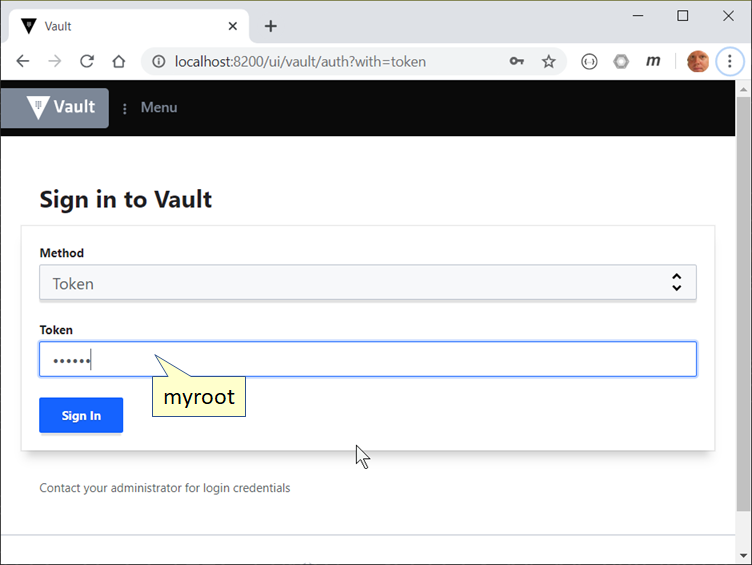

# VaultAsConfigDemo
Using Hashicorp Vault as a Configuration Store

## Prerequisites

1. Install Docker: https://docs.docker.com/get-docker/
2. Install Vault Client: https://www.vaultproject.io/downloads
3. Start Docker
4. Run `./scripts/start_docker_vault.sh` to start Vault in Docker, which will tie up the command bash shell

5. Check to make sure it started ok `./scripts/vault-status.sh`

6. Put some values into the Vault by running `./put-settings.sh` which puts the json file into the vault under `myApp/dev` using the file `myApp-dev-settings.json`

7. Run the demo in Visual Studio or Code to see how it works

8. Stop Docker Vault `./scripts/start_docker_vault.sh`

## Setting up a structure for key value pairs or json blobs

1. Decide on a folder structure, for the demo we're using a subpath of:

   `/{application}/{environment}`

2. Decide on loose key/value pairs or a json datagram. For this demo we have selected json (as we think is is tidy).

3. Store the configuration using code or the **vault** cli

## Logging into UI



## Command Line

```bash
$ ./Blitz.Configuration.Vault.Demo --help
Blitz.Configuration.Vault.Demo 1.0.0 Copyright (C) 2020 Blitz.Configuration.Vault.Demo
Blitz.Configuration.Vault.Demo 1.0.0
Copyright (C) 2020 Blitz.Configuration.Vault.Demo
USAGE:
From Environment Variables:
  VaultDemo
Vary Environment:
  VaultDemo --App myApp --Env dev --Token myroot
Full command line:
  VaultDemo --App myApp --Dump --Env dev --Root Path v1/secret/data --Token
  myroot --VaultUrl http://localhost:8200

  -u, --VaultUrl     Vault Url (env: 'vaulturl')

  -t, --Token        Vault Token (env: 'vaulttoken')

  -a, --App          Application Name (env: 'vaultapp')

  -e, --Env          Environment (env: 'vaultenv')

  -d, --Dump         Dump All Read Configuration

  -r, --Root Path    (Default: v1/secret/data) RootPath e.g. 'v1/secret/data'
                     (env: 'vaultrootpath')

  --help             Display this help screen.

  --version          Display version information.
```

## Environment Variables

|variable|description|default|
|:---|:---|:---|
|vaulturl|url to vault server|http://127.0.0.1:8200|
|vaulttoken|root token|myroot|
|vaultapp|your applicaton name|myApp|
|vaultenv|which environment are you running in|dev|
|vaultrootpath|relative path to the root of your secrets|v1/secret/data|


